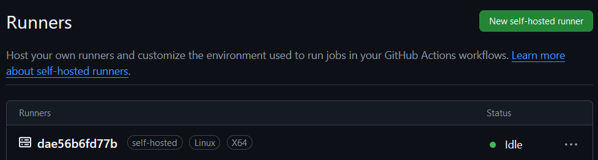

# Exercise 1

1. Fork https://github.com/evl-8/esd-github-actions-assignment
2. Go to repository `Settings > Actions > Runners` and click on `New self-hosted-runner`
3. Select Linux and scroll down to `Configure` section.
4. Extract `--url <url>` and `--token <token>` 
  Example: `$ ./config.cmd --url https://github.com/evl-8/github-action-demo --token 
  ABCDEFIGHIJKLMNOPQRSTUVW12345` extracts to  
  `Url: https://github.com/evl-8/github-action-demo` and
  `Token: ABCDEFIGHIJKLMNOPQRSTUVW12345`
5. Go into the cloned `esd-github-actions-assignment` and open the `docker-compose.yml`
6. Follow the instructions inside the file
7. Run `docker compose up`

You have now created a Github actions runner!  
It should look like the picture beneath.
The name is the Container ID of the running docker instance.

---
[Next Exercise](../exercise-2/README.md)